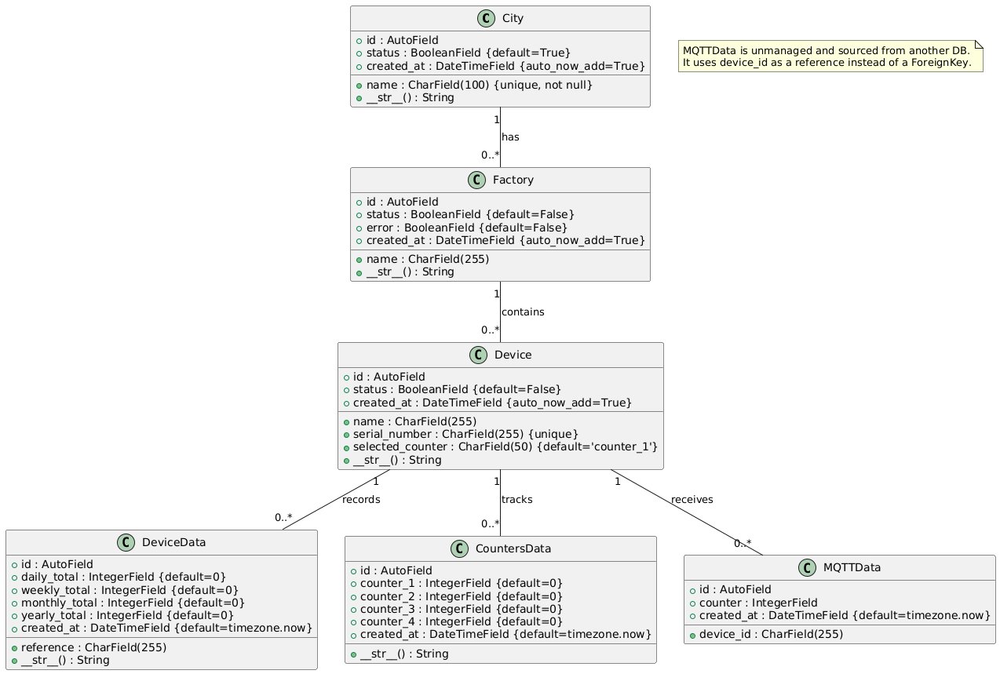

# Project-Mill

Welcome to Project-Mill, a Django-based mill management dashboard! [Go to the app](http://example.com)

## Table of Contents
- [System Requirements](#system-requirements)
- [Getting Started](#getting-started)
  - [Clone the Repository](#clone-the-repository)
  - [Navigate to the Project Directory](#navigate-to-the-project-directory)
  - [Create a Virtual Environment](#create-a-virtual-environment)
  - [Activate the Virtual Environment](#activate-the-virtual-environment)
  - [Install Django and Project Dependencies](#install-django-and-project-dependencies)
  - [Make Migrations and Migrate](#make-migrations-and-migrate)
  - [Launch the Development Server](#launch-the-development-server)

## System Requirements

Before proceeding, please ensure your system meets the following requirements:

- Python
- Pip
- Git

## Getting Started

To set up and run the "Project-Mill" Django project on your local environment, follow these professional steps:

### Step 1: Clone the Repository

Begin by cloning the project repository from GitHub:

```bash
git clone https://github.com/Jjustmee23/projeckt-mill.git
cd projeckt-Mill
```

### Step 2: Navigate to the Project Directory

Navigate to the project directory by executing the following command:

```bash
cd projeckt-Mill
```

### Step 3: Create a Virtual Environment

Create a dedicated virtual environment to isolate project dependencies and maintain a clean development environment. Use the following command:

```bash
python -m venv env
```

### Step 4: Activate the Virtual Environment

Activate the virtual environment to prepare for package installations:

**On Windows:**

```bash
.\env\Scripts\activate
```

**On macOS and Linux:**

```bash
source env/bin/activate
```

### Step 5: Install Django and Project Dependencies

Install Django, along with all project-specific dependencies, using the contents of the `requirements.txt` file:

```bash
pip install -r requirements.txt
```

### Step 6: Make Migrations and Migrate

Set up the database by making migrations and applying them:

```bash
python manage.py makemigrations
python manage.py migrate
```

### Step 7: Launch the Development Server

Commence the development server and bring your "Project-Mill" project to life:

```bash
python manage.py runserver
```

Your Django project is now up and running locally in a professional and well-organized manner.


Project ERD:
